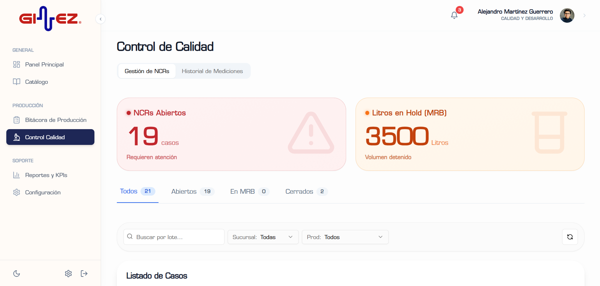

## 👋 Alejandro — QA/QC + Data/BI + Automation + Software Solutions

  
  
  
  
  
  
  

Trabajo en la intersección de la **Calidad Química (QA/QC)**, el **Análisis de Datos** y el **Desarrollo Web**. Mi enfoque es construir ecosistemas digitales que transforman la captura de datos industriales en información estratégica para la toma de decisiones, con trazabilidad total y eficiencia operativa.

---

### 🧰 Stack Tecnológico

- **Lenguajes**: TypeScript, JavaScript, Python, SQL (PL/pgSQL)
- **Web**: Next.js (App Router), React, Vite, Tailwind CSS, shadcn/ui
- **Base de Datos**: PostgreSQL (Supabase)
- **Automatización & BI**: n8n, GitHub Actions, Power BI, Docker, Git

---

### 📌 Proyectos Destacados

#### 🏢 1) [Quality Hub (PCC-GINEZ®)](https://github.com/AlejandroMartinezG/quality-hub)
**Plataforma de Control de Calidad y Gestión de Producción**  
Ecosistema diseñado para modernizar el registro de producción industrial y el aseguramiento de calidad en el **Laboratorio de Calidad y Desarrollo Ginez**.

- **Características y Robustez:**
  - **Módulo NCR (Non-Conformance Reports):** Nuevo flujo para la gestión de desviaciones y trazabilidad de acciones correctivas.
  - **Cartas de Control Interactivas:** Visualización de parámetros (% Sólidos, pH) con límites de especificación y tolerancia en tiempo real.
  - **Reportes FTQ (First Time Quality):** Análisis de conformidad por sucursal, familia de productos y SKUs prioritarios.
  - **Sincronización Inteligente:** Catálogos dinámicos conectados con Google Sheets para actualización ágil de estándares.
- **Tech:** Next.js (App Router), TypeScript, Supabase, TanStack Table, Recharts.

  
  

#### 📦 2) [App_Compras](https://github.com/AlejandroMartinezG/App_Compras)
**Gestión Estratégica de Requisiciones y Suministros**  
Sistema avanzado diseñado para **Cloro de Hidalgo** para optimizar la cadena de suministro y la comunicación entre Compras, Laboratorio y CEDIS.

- **Características y Robustez:**
  - **Módulo de Evidencias de Laboratorio:** Inspección digital con capacidad de subir hasta **5 fotos por registro** directamente desde el celular para dictámenes de liberación.
  - **Calendario Logístico Dinámico:** Monitoreo visual de entregas (FullCalendar) con estados sincronizados (Confirmado, En Tránsito, Recibido).
  - **Rediseño Premium:** Interfaz renovada con tipografía corporativa **Avenir Next** y paleta de colores institucional.
  - **Soporte de Devoluciones:** Flujo automatizado para materiales rechazados que no cumplen con los estándares químicos.
- **Tech:** Next.js 15, React 19, Supabase (Storage/Realtime), Tailwind CSS 4.

  
  

#### 🚚 3) [App_Pedidos_CEDIS](https://github.com/AlejandroMartinezG/App_Pedidos_CEDIS)
**Gestión B2B de Distribución y Operaciones Hub**  
Ecosistema para centralizar la demanda de sucursales acia el Centro de Distribución (CEDIS) y liquidación operativa.

- **Características y Robustez:**
  - **Generador de Nómina HINO:** Módulo automatizado para la liquidación de nómina de transportistas basado en rutas de entrega.
  - **Control Inteligente de Tonelaje:** Alarmas preventivas de peso al cargar las unidades, optimizando la capacidad de flota pesada.
  - **Workflow Sucursal-CEDIS:** Proceso completo desde la solicitud de fecha de recepción hasta la confirmación física en andén.
  - **UI Glassmorphism:** Interfaz de vanguardia con efectos de transparencia, diseño dual-pane y soporte nativo para Modo Oscuro.
- **Tech:** Vite, React 18, Supabase (RLS), Lucide Icons, Framer Motion.

  
  

---

### 📈 Impacto y Objetivos
- **Trazabilidad:** Auditoría en tiempo real para procesos críticos de calidad y adquisiciones.
- **Eficiencia:** Reducción del error humano y captura de datos duplicada mediante automatización.
- **UX Premium:** Interfaces intuitivas diseñadas específicamente para el personal industrial.

---

### 🤝 Idiomas
Español (Nativo) · Inglés (Técnico)

---

> *"Transformando procesos de laboratorio y logística industrial en soluciones digitales de alto impacto."*
