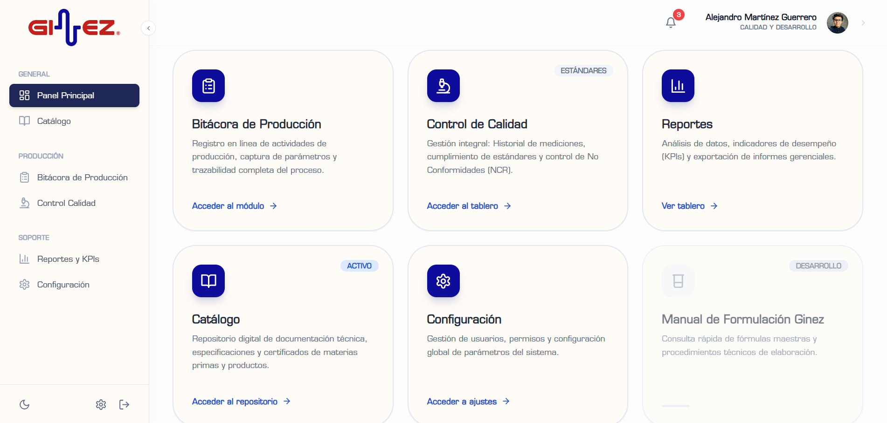
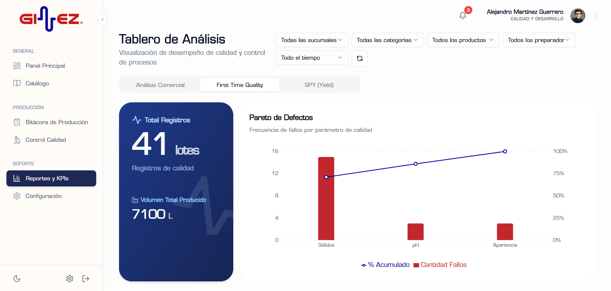
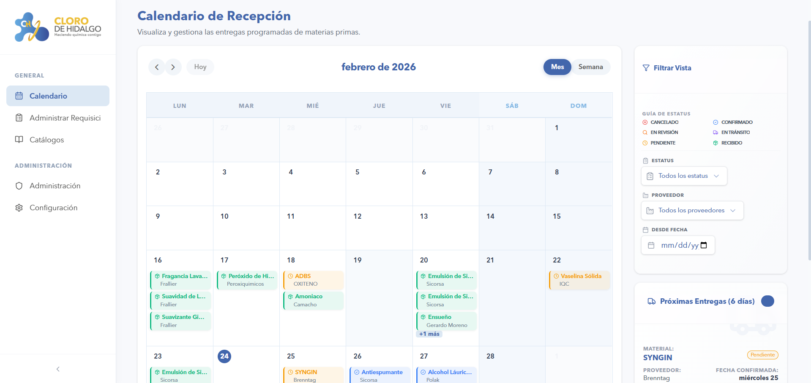

## 👋 Alejandro — QA/QC + Data/BI + Automation + Web Systems

I work at the intersection of **Chemical Quality (QA/QC)**, **data analytics**, **automation**, and **web development**.  
My focus: build systems that help teams capture quality data correctly, find it fast, and use it to improve decisions.

---

### 🔎 Areas of work
- **Chemical QA/QC**: finished products, physicochemical parameters, traceability & documentation
- **Web systems**: frontend + backend + databases for internal tools
- **Data & automation**: workflows and interfaces that reduce friction and improve data quality

---

### 🧰 Core stack
- **Languages**: TypeScript, JavaScript, Python
- **Web**: Next.js (App Router), Tailwind CSS, Supabase
- **Database**: PostgreSQL (PLpgSQL), SQL
- **Automation**: n8n, GitHub Actions
- **Other**: VPS, Git/GitHub, Docker, Power BI

---

### 📌 Featured projects

#### 1) [quality-hub (PCC-GINEZ®)](https://github.com/AlejandroMartinezG/quality-hub)
**Enterprise Quality Control Platform (QA/QC)**  
A robust system designed to modernize industrial production logging and quality assurance.
- **Purpose:** Centralize laboratory standards, real-time production monitoring, and Non-Conforming Reports (NCR) management.
- **Tech Stack:** Next.js (App Router), TypeScript, Tailwind CSS, Supabase, TanStack Table, Zod, and shadcn/ui.
- **Key Features:** 
  - **Live Production Log:** High-precision data capture for real-time monitoring.
  - **Advanced Analytics:** KPI dashboards (e.g., pH conformity) and automated PDF/Excel reports.
  - **Role-Based Security:** RBAC implementation for laboratory, production, and admin roles.

  
  

#### 2) [App_Compras](https://github.com/AlejandroMartinezG/App_Compras)
**Logistics & Procurement Tracking System**  
Specialized internal tool for "Cloro de Hidalgo" to optimize raw material supply chains.
- **Purpose:** Automate the lifecycle of purchase requisitions and coordinate delivery logistics.
- **Tech Stack:** Next.js, TypeScript, Supabase (PLpgSQL), and Tailwind CSS.
- **Key Features:** 
  - **Procurement Calendar:** Visual tracking of technical and logistics delivery schedules.
  - **Multi-Role Approval:** Integrated flow between Laboratory and CEDIS to ensure supply integrity.
  - **Real-time Status:** End-to-end monitoring from "Pending" to "Delivered" with instant updates.

  

---

### 📈 Impact (current)
- Improved UI and streamlined information processing for production/quality logging
- Reduced time and friction in data capture and record-keeping

---

### 🤝 Collaboration / opportunities
Open to: opportunities, code reviews, ideas, contributions, and suggestions.

---

### 📚 Currently learning
Google Antigravity · Stitch · Google AI Studio · NotebookLM · Claude Code · Git/GitHub

---

### 🧭 Principles
- **Good manufacturing practices mindset**: traceability, standardization, clear documentation
- **Data quality first**: validation, constraints, consistent identifiers, audit-ready logs
- **Security by default**: least privilege, secrets management, safe deployment habits
- **Pragmatism**: build small, measurable improvements that stick

---

### 🌍 Languages
Spanish (native) · English

> Portfolio link: (coming soon)
