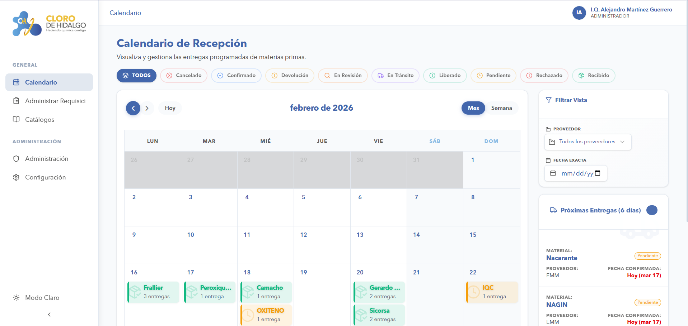
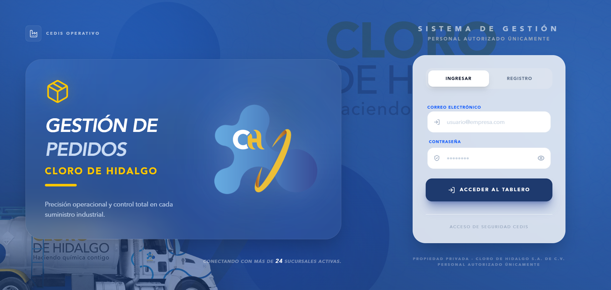
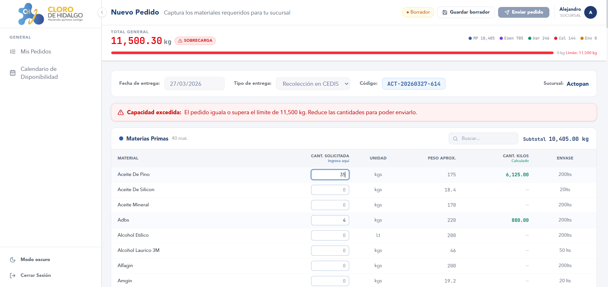

## 👋 Alejandro — Ingeniería de Software Industrial 

  
  
  
  
  
  
  

> *"Este perfil piensa como ingeniero, estructura como arquitecto y ejecuta como developer."*

Soy un **Quality Assurance Domain Expert** evolucionado a **Full-Stack Software Engineer**. Me especializo en diseñar y construir ecosistemas digitales B2B que transforman operaciones industriales complejas (QA/QC, manufactura, logística) en flujos de datos automatizados, trazables y altamente eficientes.

---

### 🧩 Core Competencies

- **Calidad Industrial y Procesos (QA/QC):** Control Estadístico de Procesos (SPC), Gestión de No Conformidades (NCR), Digitalización de KPIs Navieros y de Manufactura.
- **Ingeniería de Software:** Arquitecturas Frontend (Next.js/React/Vite), Diseño UI/UX enfocado en operarios industriales, Bases de Datos Relacionales y Seguridad RLS.
- **Datos y Automatizaciones:** Creación de pipelines ETL, automatización de Workflows operativos (Python, n8n) y Business Intelligence (Power BI).

---

### 🧰 Tech Stack Matrix

| **Desarrollo Frontend / UX** | **Backend & Cloud Architecture** | **Data, IA & Tools** |
| :--- | :--- | :--- |
| Next.js 14/15, React 19, Vite | Node.js / TypeScript | Python, n8n |
| Tailwind CSS v4, shadcn/ui | PostgreSQL (Supabase) | Power BI, SQL (PL/pgSQL) |
| Glassmorphism & UI/UX Design | Supabase Auth, Storage & Realtime | Git, GitHub Actions, Docker |

---

### 💼 Portfolio de Proyectos: Impacto Operativo

#### 🏢 1) [Quality Hub (PCC-GINEZ®)](https://github.com/AlejandroMartinezG/quality-hub)
**Digital Quality Control & Analytics Platform**  
Sistema core diseñado para la modernización del registro industrial en el **Laboratorio de Calidad y Desarrollo Ginez**.

-   **Impacto Organizacional:** Reducción histórica de tiempos de auditoría de calidad mediante la digitalización del 100% de la bitácora de producción.
-   **Ingeniería de Resolución:**
    -   **Módulo NCR Automatizado:** Ecosistema completo para el rastreo y cierre de No Conformidades (trazabilidad ISO 9001-style).
    -   **Cartas de Control Inteligentes:** Visualización y validación interactiva de parámetros (% Sólidos, pH) con alertas dinámicas frente a límites de especificación cruzados desde catálogos dinámicos (Google Sheets).
    -   **Reportes FTQ (First Time Quality):** Dashboards gerenciales para el seguimiento de la conformidad por líneas de producto.
-   **Tech:** Next.js (App Router), TypeScript, Supabase, TanStack Table, Recharts.

  
  

#### 📦 2) [App_Compras](https://github.com/AlejandroMartinezG/App_Compras)
**Gestión Estratégica de Cadena de Suministro (Supply Chain)**  
Ecosistema de control logístico creado para **Cloro de Hidalgo**, eliminando cuellos de botella mediante comunicación en tiempo real entre Compras, Laboratorio y el Centro de Distribución (CEDIS).

-   **Impacto Organizacional:** Minimización del tiempo de inactividad de mercancías y simplificación masiva del rastreo operativo de las órdenes.
-   **Ingeniería de Resolución:**
    -   **Módulo "Evidence-First" de Laboratorio:** Inspección en terreno con subida de hasta 5 fotografías técnicas por material, almacenadas en la nube y vinculadas al dictamen final de liberación del lote.
    -   **Calendario Logístico Dinámico:** Desarrollo de un tracker temporal avanzado (FullCalendar) con estados de remisión codificados por colores.
    -   **Corporate UX/UI:** Rediseño premium enfocado en usabilidad, integrando tipografías corporativas (Avenir Next) y manejo ágil de rechazos / devoluciones.
-   **Tech:** Next.js 15, React 19, Supabase (Storage/Realtime), Tailwind CSS 4.

  
  

#### 🚚 3) [App_Pedidos_CEDIS](https://github.com/AlejandroMartinezG/App_Pedidos_CEDIS)
**Hub B2B de Gestión de Distribución y Operaciones**  
Plataforma centralizada para orquestar la demanda de la red de sucursales frente a la capacidad real de despacho del CEDIS.

-   **Impacto Organizacional:** Disminución de errores manuales de solicitud y optimización empírica de la flota de transporte.
-   **Ingeniería de Resolución:**
    -   **Algoritmo de Tonelaje Inteligente:** Arquitectura preventiva orientada a calcular dinámicamente el peso por pedido, generando alarmas visuales si se excede la capacidad logística de la flota pesada (HINO).
    -   **Generador Automático de Nóminas:** Pipeline especializado para convertir las operaciones logísticas completadas en formatos contables procesables, automatizando la liquidación final del chofer.
    -   **UI de Alto Desempeño:** Interfaz moderna aplicando filosofía *Glassmorphism* y tematización dual nativa (Dark Mode) adaptada para operarios en andén.
-   **Tech:** Vite, React 18, Supabase (RLS), Lucide Icons, Framer Motion.

  
  

---

### ⚙️ Metodología de Resolución

1.  **Inmersión Operativa:** Antes de abrir el editor de código, analizo la fricción real en campo (con químicos, choferes o analistas de compras).
2.  **Arquitectura de Datos Rigurosa:** Trunco el caos modelando tablas relacionales sólidas implementando políticas robustas de *Row Level Security* (RLS).
3.  **Desarrollo Moderno y Escalable:** Construyo ecosistemas modulares con Server Components y tipado fuerte.
4.  **Trazabilidad:** Implementación final enfocada en que el operador registre datos orgánicamente, mientras la gerencia extrae *insights* auditables.

---

### 🧠 Enfoque y Aprendizaje Continuo

Para llevar la digitalización industrial al siguiente nivel, exploro constantemente las tecnologías de frontera:
-   **Sistemas Multi-Agente (Agentic Coding & AI).**
-   **Orquestación de Servidores VPS y Arquitecturas Autogestionadas.**
-   **Integración de Modelos de IA Predictiva** para análisis de fallos recurrentes en parámetros de calidad.

---

### 📬 Conectemos
**Idiomas:** Español (Nativo) · Inglés (Técnico / Intermedio Alto)  
📍 **Operaciones Digitales** | México  

